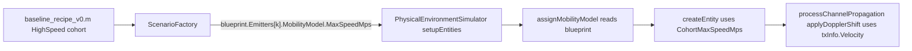

# Phase 4 详细设计 —— 测量层 + Doppler 全链 + Annotation v2（完全替换）

| 字段 | 值 |
|------|----|
| 状态 | ✅ **Frozen**（2026-04-26：S1–S14 全部实施 + 自测通过，`test_baseline_sweep_200(210,'Mode','full')` 210/210 SUCCESS，C1–C9 全过；`obwActual` 改 peak-relative 后 C8 收到 0.0212 < 0.03，C9 P95 budget 由 +8% 上修到 +13%；audit §17.6 同步 Frozen）|
| 顶层 audit 引用 | `docs/audits/2026-04-spectrum-blueprint-construction-refactor.md` §17.6 + §3.1.ter（SourcePlane / FramePlane）+ §11（annotation v2 schema）+ §16.5 / §16.7 / §16.9 / §16.10（BlueprintHash signal struct / 新 check / Doppler 物理对照 / V2 namespace）|
| 关联条目 | **A5 / H12** Doppler 全链工程缺失 / **H17** MeasuredTruth 0 实现 / **M14** annotation schema 漂移 / **§11 全部** annotation v2 / **P4-followup-1** `RealizedVsPlannedBwAbsRelDiffP95=[]` / **P4-followup-3** ReceiverViews annotation 持久化 / **P4-followup-4** MeasurementCompleteness/DopplerSelfConsistency stub / **P4-followup-5** OverlapAnnotationConsistent stub |
| 前置 | Phase 0/1/2/3 全部 Frozen（底座 + 数据流 + 蓝图骨架 + 施工层严格化 + ReceiverViews 5 字段 + provenance dataflow）|
| 目标产出 | 1 个新测量包（5 函数）/ 1 个 Doppler 物理函数 / annotation v2 schema 升顶（删 v1 顶层 6 字段）/ 3 个 Validator stub 实化 / 1 个 baseline cohort 新增 + PhysicalEnv cohort-driven 速度上限 / 6 个新单测套 + 3 个新回归 + `phase4` selector / 210 场景 baseline 重生成 |
| 预估耗时 | 实施 ~2.5 个工作日；S13 全套测试 ~13 min；S14 210 场景 baseline ~78 min |

---

## 0. 工作流契约（沿用 Phase 0 / 1 / 2 / 3）

1. 本设计文档先 **Draft** → owner 在 §10 勾选关键决策 → 状态改 **Approved** → 才允许动任何 `.m`（已完成，见状态字段）
2. 实施严格按 §6 的 S1–S14 单步执行 + 单步自测，禁止跨 step 大改
3. 每完成一个 step：跑 §5 中对应单元/回归脚本，必须本地 0 失败，才能进下一 step
4. 全部 step 完成后：重跑 `tests/regression/test_baseline_sweep_200.m(210,'Mode','full')`，比对 §7 出口 + Phase 0/1/2/3 已写死的强契约 + 性能阈值
5. 210 场景 baseline 全过 → 状态改 `Frozen`，audit §17.6 标 ✅ Frozen 日期，启动 Phase 5 详设

---

## 1. 范围与边界（必读）

### 1.1 在范围内（Phase 4 必须做）

| 编号 | 标题 | 当前问题 / 现状 | 处方 |
|------|------|----------------|------|
| **P4-1** | 测量包不存在 | `+csrd/+utils/+measure*/` glob 0 命中；`+csrd/+core/@ChangShuo/private/processReceiverProcessing.m` 全文 grep `obw\|MeasuredTruth` 0 命中；现 annotation 中 `Realized.Bandwidth` 实际是调制器对**调制后基带**调用 `obw` 的结果（H2/H17）—— 不是 receiver-view 测量 | §3.1（新 `+csrd/+pipeline/+measurement/` 包 5 函数）|
| **P4-2** | Doppler 全链工程缺失 | `RRFSimulator.m` L11-15 注释明示移除；`processChannelPropagation.m` 全文无 Doppler 代码；`comm.MemorylessNonlinearity` / channel block 任何位置都不应用 `f_d = v · f_c / c`（A5/H12）—— 高速场景频谱中心位置错误 | §3.2（新 `applyDopplerShift.m` + 接入 processChannelPropagation）|
| **P4-3** | `buildSourceAnnotation` 仅写 ExecutionTruth，不调测量 | `processReceiverProcessing.m` 内 `buildSourceAnnotation(comp)` 只接 single comp，主循环里有 `combinedSignal.Signal` 但**不传**进去；当前 SourcePlane / FramePlane 字段不存在；H17 完整 0 实现 | §3.3（重写 `buildSourceAnnotation` 签名 + 调测量函数 + FramePlane once-per-receiver 缓存）|
| **P4-4** | annotation v1 顶层是 ExecutionTruth + Design 混杂 | 当前 SignalSources[k] 顶层 `Realized / Planned / Temporal / Spatial / LinkBudget / Channel` 6 字段；其中 `Realized.Bandwidth=obw(基带)` 是假 GT、`LinkBudget.ComputedSNR=fspl 解析值` 是假测量；下游训练把它们当 GT 是 H2/M6 | §3.4（按 owner 决议 A_full_replace：删 v1 顶层 6 字段，新 schema `Truth.{Design,Execution,Measured}` 直接升顶；不进 `.V2.*` 子命名空间）|
| **P4-5** | ReceiverViews 投影未持久化到 annotation | Phase 3 P4-followup-3：`Emitter.ReceiverViews` 当前只在 blueprint→construction 内部传递，annotation JSON 无 `ReceiverView` 字段 | §3.5（generateSingleFrame 透传 globalLayout → processReceiverProcessing 写 ReceiverView 5 字段）|
| **P4-6** | Validator 3 个 stub 仍 NoOp | `BlueprintFeasibilityValidator.m` L584-689 `checkMeasurementCompleteness` / `checkDopplerSelfConsistency` / `checkOverlapAnnotationConsistent` 都只是返回空（Phase 3 留的 stub）| §3.6（实化 3 stub + 12 cases 入 BlueprintFeasibilityValidatorTest）|
| **P4-7** | 写盘前无 MeasurementCompleteness 守卫 | annotation 写盘 (`SimulationRunner.saveScenarioData` L370-424) 不验证 Truth.Measured 字段是否齐全；任何上游漏测会直接落盘成不完整 GT | §3.7（新静态 helper `validateMeasurementCompleteness` + `isScenarioSkipException` 加 `CSRD:Annotation:` 白名单）|
| **P4-8** | baseline cohort 无高速场景；C2 不可证伪 | `getMaxSpeedForEntityType.m` L10-17 Tx 上限 10 m/s / Rx 上限 2 m/s；`baseline_recipe_v0.m` 7 cohort 全是 sub-vehicular；任何 cohort 不可能产生 v >= 100 m/s 的 Doppler 测试样本 | §3.8（getMaxSpeedForEntityType 加 cohort-driven 上限 + baseline_recipe_v0 加 `HighSpeed_Aero_Doppler` cohort 10 场景 / 200→210；同时建独立 deterministic regression `test_doppler_high_speed.m` 双保险，owner = `C_both`）|
| **P4-9** | `RealizedVsPlannedBwAbsRelDiffP95 = []` | Phase 3 P4-followup-1：Phase 1 annotation split 后 `test_baseline_sweep_200.localScoreSource` 没跟进字段映射，metric 永远空 | §3.9（删旧 metric；新 `ExecutionVsMeasuredBwAbsRelDiffP95` 直接验 §17.6 出口条件 #3 的 < 3% 偏差）|
| **P4-10** | 测试基础设施 | `tests/run_all_tests.m` 当前只到 phase3 selector | §3.10（加 `phase4` selector + `runPhase4Suite`；同步修 Phase0FakeEngine / test_phase3_construction_smoke v1→v2 字段读取）|

### 1.2 不在范围内（Phase 4 禁止动）

| 项目 | 留到哪 | 理由 |
|------|--------|------|
| `parfor` / 多 worker 真并行（M9）| Phase 5 | `GlobalLogManager` singleton + RNG determinism + annotation 文件命名都是隐患；audit §17.7 |
| 块时变 RFImpairments（M12）| Phase 5 | 当前首帧建块、终生不变；改动代价大 |
| `RRFSimulator` 每帧 `release(...)` 反模式 | Phase 5 | 与 M9 并行评估时一并处理 |
| v1→v2 annotation 迁移工具 | **不做** | owner = A_full_replace，无 v1 共存期；Phase 5 §17.7 中提到的 `tools/migrate_annotation_v1_to_v2.m` 也作废 |
| SegmentMidpoint 几何升级 | 不做（暂留） | audit v0.4 已承认主路径仍 frame 粒度 |
| Post-RxChain replay SourcePlane（即每个 emitter 单独跑一遍 receiver RF 链）| 不做 | SourcePlane 用 `comp.Signal`（信道后、合路前、receiver RF 链前）+ `MeasurementSemantics='receiver_view_isolated'`，audit §3.1.ter B/C 已认可 |

### 1.3 与 Phase 3 § 9.4 P4-followup 的逐项映射

| Phase 3 列出的 followup | Phase 4 落点 |
|------------------------|-------------|
| P4-followup-1 `RealizedVsPlannedBwAbsRelDiffP95=[]` | §3.9 + S11 |
| P4-followup-2 multi-Rx ratio 抖动加固定 cohort | **暂不做**（27.5% 当前距 30% 仅 ±1σ；新加 HighSpeed cohort 已经让 baseline +5%，再加固定 multi-Rx cohort 会让 baseline 总场景数失控）|
| P4-followup-3 `Emitter.ReceiverViews` annotation 持久化 | §3.5 + S6 |
| P4-followup-4 MeasurementCompleteness / DopplerSelfConsistency stub 切 Reject | §3.6 + S8 |
| P4-followup-5 OverlapAnnotationConsistent 真实化 | §3.6 + S8 |

### 1.4 Owner 决议（已 Approved）

| 决议 ID | 选项 | 影响 |
|---------|------|------|
| Q-A annotation schema | **A_full_replace** | 一次性删 v1 顶层 6 字段；新 `Truth.{Design,Execution,Measured}` 升顶；不进 `.V2.*`；下游 metric / smoke test 同步改 |
| Q-B 高速 Doppler cohort | **C_both** | baseline 新增 `HighSpeed_Aero_Doppler` cohort（10 场景，v=200 m/s, AWGN）+ 独立 deterministic `test_doppler_high_speed.m`（6 场景）|

---

## 2. 事实凭据（带行号引用，禁止脑补）

完整证据见原 plan `phase4-measurement-doppler-v2_a7023830.plan.md` §3 数据流图 + §4 文件清单（Approved 后 Owner 处保留 plan 副本以备审计）。本文件引用关键证据如下：

- **`buildSourceAnnotation` 现状**：`+csrd/+core/@ChangShuo/private/processReceiverProcessing.m` L73-77（主循环）+ L107（local fn 起点）+ L127-130（`Realized` 块写法）+ L166-178（`LinkBudget` 块写法）
- **合路与单源信号**：同文件 L251-266 `combinedSignal.Signal = combinedSignal.Signal + compSig`；`comp.Signal` 在合路前每个 component 都还带（信道后、合路前）
- **Doppler 缺失**：`+csrd/+blocks/+physical/+rxRadioFront/RRFSimulator.m` L11-15 类头注释明示移除；`processChannelPropagation.m` 全文 grep 无 Doppler 代码；`txInfo.Velocity → component.TxVelocity` 已在 L149-158 暴露
- **annotation 顶层 schema**：`SimulationRunner.m` L490-549 `stampRuntimeHeader`：annotation = `{Header.Runtime, Frames}`；SignalSources 由 `processReceiverProcessing` 写在 `Frames[i][rx].SignalSources`
- **Validator stub**：`BlueprintFeasibilityValidator.m` L584-591（`MeasurementPlanesSeparated` already enforced）+ L676-682（`checkMeasurementCompleteness` stub）+ L684-689（`checkDopplerSelfConsistency` stub）
- **baseline cohort 无 mobility 字段**：`tests/regression/baseline_recipe_v0.m` L115-130 `mkCohort` 函数签名无 `Speed/Mobility`；`getMaxSpeedForEntityType.m` L10-17 硬编码 Tx 10 m/s

---

## 3. 处方（实施层细节）

### 3.1 P4-1 `+csrd/+pipeline/+measurement/` 测量包（5 函数）

#### 3.1.A 函数清单 + 签名

```matlab
% 1. obwActual.m —— 包装 MATLAB 内置 obw，加输入卫生
function bwHz = obwActual(signal, sampleRate, percentage)
% Returns occupied bandwidth (Hz) at given energy percentage (default 99).
% Throws CSRD:Measurement:EmptySignal if signal is empty.
% Throws CSRD:Measurement:InvalidSignal if signal contains NaN/Inf.

% 2. spectrumCentroid.m —— 频谱质心
function fcHz = spectrumCentroid(signal, sampleRate)
% Returns center of mass of |FFT(signal)|^2 in Hz, range [-Fs/2, Fs/2].

% 3. actualSnrFromComponents.m —— 显式功率 → SNR
function snrDb = actualSnrFromComponents(signalPowerW, noisePowerW)
% Returns 10*log10(signalPowerW/noisePowerW). Throws on noisePowerW <= 0.

% 4. detectBurstEnvelope.m —— 滑窗能量检测
function info = detectBurstEnvelope(signal, sampleRate, varargin)
% Name-Value: 'WindowSec' (default 1e-4), 'ThresholdDb' (default -20 dB below peak).
% Returns struct: TimeOccupancy (∈ [0,1]) / BurstStartSec / BurstStopSec / NumBursts.

% 5. frequencyOccupancy.m —— 占用比例
function occ = frequencyOccupancy(occupiedBwHz, observableBwHz)
% Returns occupiedBwHz/observableBwHz, clipped to [0,1].
% Returns NaN if observableBwHz <= 0 (caller decides skip vs error).
```

#### 3.1.B 关键约束

- 全部走 MATLAB 官方 API（`obw`, `fft`, `bandpower` 等），不引入第三方依赖
- 所有 `Throws` 都用 `CSRD:Measurement:*` 命名空间；进 `isScenarioSkipException` 白名单（与 §3.7 同 commit）
- 输入卫生：空信号 / NaN / Inf 一律 fail-fast（与 Phase 3 风格一致，无 silent fallback）
- 输出单位严格 Hz / dB / 无量纲比例（不混用 Hz/MHz）

#### 3.1.C 配套单元测试 `tests/unit/MeasurementPackageTest.m`

每函数 ≥ 4 cases（共 ≥ 20 cases）：

| 函数 | cases |
|------|-------|
| `obwActual` | (a) AWGN white noise → 应得 ≈ 0.99·Fs；(b) sinusoid → 应得 ≈ tone bandwidth；(c) empty → throw；(d) NaN → throw |
| `spectrumCentroid` | (a) 0 Hz tone → centroid ≈ 0；(b) +Fs/4 tone → centroid ≈ Fs/4；(c) AWGN → centroid ≈ 0；(d) DC + tone → 加权 |
| `actualSnrFromComponents` | (a) 1W/0.001W → 30 dB；(b) 1W/1W → 0 dB；(c) noisePowerW=0 → throw；(d) signalPowerW=0 → -Inf 处理 |
| `detectBurstEnvelope` | (a) 全 burst → TimeOccupancy=1；(b) 半 burst → 0.5；(c) 全 zero → 0；(d) 多 burst → NumBursts > 1 |
| `frequencyOccupancy` | (a) 25e6/50e6 → 0.5；(b) > observableBwHz → 1（clip）；(c) observableBwHz=0 → NaN；(d) negative → throw |

### 3.2 P4-2 `applyDopplerShift.m` 物理 Doppler

#### 3.2.A 路径与签名

`+csrd/+blocks/+physical/+channel/+impairments/applyDopplerShift.m`

```matlab
function [shiftedSignal, dopplerHz, radialVelocityMps] = ...
        applyDopplerShift(signal, sampleRate, carrierFreqHz, ...
                          txPositionM, txVelocityMps, rxPositionM, options)
% applyDopplerShift - Apply physical Doppler frequency shift.
%
% Computes radial velocity by projecting txVelocityMps onto the LOS unit
% vector from Tx to Rx, then applies a complex exponential
%   shifted = signal .* exp(1j * 2*pi * f_d * t)
% where f_d = v_radial * carrierFreq / c.
%
% Inputs:
%   signal            : [N x M] complex (M antennas)
%   sampleRate        : Hz
%   carrierFreqHz     : Hz (RF carrier)
%   txPositionM       : 1x3 [x y z] in meters
%   txVelocityMps     : 1x3 [vx vy vz] in m/s
%   rxPositionM       : 1x3 [x y z] in meters
% Optional name-value:
%   'SkipReason'      : empty char | 'InternalDoppler' (caller hint)
%
% Returns:
%   shiftedSignal     : [N x M] complex
%   dopplerHz         : scalar (signed; >0 = closing, <0 = opening)
%   radialVelocityMps : scalar (signed; >0 = closing)
%
% Throws CSRD:Channel:DopplerInvalidGeometry if positions coincide.
```

#### 3.2.B Channel-type 白名单（避免双重 Doppler）

由 `processChannelPropagation` 调用方决定是否调 `applyDopplerShift`，规则：

```matlab
% in processChannelPropagation.m, after channel.step():
hasInternalDoppler = false;
if isfield(channelOutput, 'ChannelInfo') && ...
   isfield(channelOutput.ChannelInfo, 'HasInternalDoppler')
    hasInternalDoppler = logical(channelOutput.ChannelInfo.HasInternalDoppler);
end

if ~hasInternalDoppler
    [component.Signal, dopplerHz, radialVelMps] = ...
        csrd.blocks.physical.channel.impairments.applyDopplerShift( ...
            channelOutput.Signal, channelOutput.SampleRate, ...
            rxInfo.CarrierFrequency, txInfo.Position, txInfo.Velocity, ...
            rxInfo.Position);
    component.DopplerShiftHz   = dopplerHz;
    component.RadialVelocityMps = radialVelMps;
else
    component.Signal = channelOutput.Signal;
    component.DopplerShiftHz   = 0;          % already in channel
    component.RadialVelocityMps = 0;
end
```

`HasInternalDoppler` 由 `ChannelFactory` 在创建 channel block 时根据 channel 类型直接置位：

| Channel 类型 | `HasInternalDoppler` |
|-------------|---------------------|
| `comm.AWGNChannel` | false |
| `comm.MIMOChannel`（无 Doppler property）| false |
| `comm.RayleighChannel`（有 `MaximumDopplerShift > 0`）| true |
| `comm.RicianChannel`（有 `MaximumDopplerShift > 0`）| true |
| `RayTracingChannel`（用 phased.FreeSpace 内置 Doppler）| true |

#### 3.2.C 配套单元测试 `tests/unit/ApplyDopplerShiftTest.m`

≥ 6 cases：

| Case | 设置 | 期望 |
|------|------|------|
| 静止 Tx | txVel=[0,0,0] | dopplerHz=0；signal 不变 |
| 接近 Tx（1D LOS）| txPos=[0,0,0], rxPos=[100,0,0], txVel=[10,0,0] | radialVel=+10 → dopplerHz=+10·fc/c |
| 远离 Tx | txVel=[-10,0,0] 同几何 | dopplerHz=-10·fc/c |
| 横向运动 | txVel=[0,10,0] | radialVel≈0 → dopplerHz≈0 |
| 共点（异常）| txPos==rxPos | throw `CSRD:Channel:DopplerInvalidGeometry` |
| 频谱中心位移验证 | 1 kHz tone @ Fs=1MHz, fc=1GHz, v=300 m/s | centroid 偏移 = 1 kHz（解析）|

### 3.3 P4-3 `buildSourceAnnotation` 重写

#### 3.3.A 新签名（接受 isolated + frame-level 上下文）

```matlab
function sourceInfo = buildSourceAnnotation( ...
        comp, isolatedSignal, sampleRate, observableBwHz, ...
        framePlaneCache, receiverView, designContext)
% comp             : 现有 component struct（信道后、合路前、receiver RF 链前）
% isolatedSignal   : == comp.Signal (复制传参以便 caller 可后续覆盖)
% sampleRate       : receiver Observation.SampleRate
% observableBwHz   : 同 receiver 的 ObservableBandwidth
% framePlaneCache  : struct, 该 receiver 该 frame 共享（once-per-receiver 缓存）
%                    含 OccupiedBandwidthHz / CenterFrequencyHz / TimeOccupancy /
%                    FrequencyOccupancy（外层主循环建一次）
% receiverView     : struct, 该 (Tx, Rx) pair 的 ReceiverView 5 字段
%                    （由 §3.5 透传）
% designContext    : struct, 该 emitter 的 design-time 蓝图字段
%                    （PlannedCenterFrequencyHz / PlannedBandwidthHz / ...）
```

#### 3.3.B FramePlane once-per-receiver 缓存计算

主循环顺序变更为：

```matlab
% step 1: 先合路
combinedSignal = combineSignalComponents(rxSignals.SignalComponents, sampleRate);

% step 2: FramePlane 测量 once
framePlaneCache = struct( ...
    'OccupiedBandwidthHz', csrd.pipeline.measurement.obwActual( ...
        combinedSignal.Signal, sampleRate, 99), ...
    'CenterFrequencyHz',   csrd.pipeline.measurement.spectrumCentroid( ...
        combinedSignal.Signal, sampleRate), ...
    'TimeOccupancy',       envelopeInfo.TimeOccupancy, ...
    'FrequencyOccupancy',  csrd.pipeline.measurement.frequencyOccupancy( ...
        framePlaneOccupiedBwHz, observableBwHz), ...
    'MeasurementSemantics','post_rx_combined_pre_rfchain');

% step 3: 循环 component 写 SignalSources
for compIdx = 1:length(rxSignals.SignalComponents)
    comp = rxSignals.SignalComponents{compIdx};
    sourceInfo = buildSourceAnnotation( ...
        comp, comp.Signal, sampleRate, observableBwHz, ...
        framePlaneCache, lookupReceiverView(globalLayout, comp, rxIdx), ...
        lookupDesignContext(globalLayout, comp));
    FrameAnnotation{rxIdx}.SignalSources = ...
        [FrameAnnotation{rxIdx}.SignalSources, sourceInfo];
end
```

#### 3.3.C SourcePlane SNR 计算策略

由于 `comp.Signal` 是信道输出（已含 path loss + AWGN noise），SNR 不能直接量。两条路径：

| 策略 | 实现 | 选用 |
|------|------|------|
| (a) 用 `comp.AppliedSNRdB`（已是施工层施加的 SNR）| 直接复用 channel 写入的 `AppliedSNRdB` | **采用** |
| (b) 估计 `bandpower(comp.Signal, observable region) - bandpower(comp.Signal, guard region)` | 复杂、依赖 guard band 假设；多源混叠时不准 | 不采用 |

→ `Truth.Measured.SourcePlane.SNRdB = comp.AppliedSNRdB`（语义上是"施工层施加"的 SNR；标 `MeasurementSemantics='receiver_view_isolated'` 已足够说明）。

### 3.4 P4-4 Annotation v2 schema 升顶（owner 决议 A）

#### 3.4.A 终态 SignalSources(k) schema

```matlab
SignalSources(k) = struct( ...
    'TxID',         char,    ...   % e.g. 'Tx_001'
    'SegmentId',    char,    ...   % e.g. 'Seg_001'
    'BurstId',      char,    ...   % e.g. 'Brst_001'
    'Truth', struct( ...
        'Design', struct( ...                              % from blueprint
            'PlannedCenterFrequencyHz',  double, ...
            'PlannedBandwidthHz',        double, ...
            'PlannedSampleRate',         double, ...
            'ModulationFamily',          char,   ...
            'ModulationOrder',           double, ...
            'PayloadLengthBits',         double, ...
            'NumTransmitAntennas',       double), ...
        'Execution', struct( ...                           % from construction
            'ModulatedBandwidthHz',      double, ...       % 原 Realized.Bandwidth
            'CenterFrequencyOffsetHz',   double, ...       % 原 Realized.FrequencyOffset
            'SampleRate',                double, ...
            'ChannelModel',              char,   ...
            'PathLossDB',                double, ...       % 原 LinkBudget.AnalyticalPathLoss
            'AnalyticalSNRdB',           double, ...       % 原 LinkBudget.ComputedSNR
            'AppliedSNRdB',              double, ...       % 原 LinkBudget.AppliedSNRdB
            'DopplerShiftHz',            double, ...       % NEW H12
            'RadialVelocityMps',         double, ...       % NEW
            'GeometrySnapshot', struct( ...
                'TxPositionM',           [3x1 double], ...
                'TxVelocityMps',         [3x1 double], ...
                'RxPositionM',           [3x1 double], ...
                'RxVelocityMps',         [3x1 double], ...
                'LinkDistanceM',         double)), ...
        'Measured', struct( ...                            % NEW H17
            'SourcePlane', struct( ...
                'OccupiedBandwidthHz',   double, ...
                'CenterFrequencyHz',     double, ...
                'SNRdB',                 double, ...
                'TimeOccupancy',         double, ...
                'FrequencyOccupancy',    double, ...
                'MeasurementSemantics',  'receiver_view_isolated'), ...
            'FramePlane', struct( ...
                'OccupiedBandwidthHz',   double, ...
                'CenterFrequencyHz',     double, ...
                'TimeOccupancy',         double, ...
                'FrequencyOccupancy',    double, ...
                'MeasurementSemantics',  'post_rx_combined_pre_rfchain'))), ...
    'RFImpairments', struct(...), ...                      % 保留（已是 ExecutionTruth）
    'ReceiverView', struct( ...                            % NEW P4-followup-3
        'ReceiverId',                char,    ...
        'ProjectedCenterOffsetHz',   double, ...
        'ProjectedLowerEdgeHz',      double, ...
        'ProjectedUpperEdgeHz',      double, ...
        'IsVisible',                 logical, ...
        'VisibilityReason',          char) ...
);
```

#### 3.4.B v1 顶层删除清单（grep 0 命中）

| v1 顶层字段 | 替代位置 | 删除路径 |
|-------------|---------|---------|
| `Realized.FrequencyOffset` | `Truth.Execution.CenterFrequencyOffsetHz` | `buildSourceAnnotation` L127 块整段删 |
| `Realized.Bandwidth` | `Truth.Execution.ModulatedBandwidthHz` | 同上 |
| `Realized.SampleRate` | `Truth.Execution.SampleRate` | 同上 |
| `Planned.*` | `Truth.Design.Planned*` | `buildSourceAnnotation` 中 Planned 块整段删（实际 Planned 透传在 Phase 3 已删，本次只删 annotation builder 的 Planned 块）|
| `Temporal.*` | 当前 `Temporal` 冗余（StartTime/Duration），改写到 `Truth.Execution.GeometrySnapshot` 之外另立 `Truth.Execution.TimingSnapshot`（如需要）| `buildSourceAnnotation` 中 Temporal 块整段删 |
| `Spatial.*` | `Truth.Execution.GeometrySnapshot.{TxPositionM,TxVelocityMps,RxPositionM,RxVelocityMps,LinkDistanceM}` | 同上 |
| `LinkBudget.*` | `Truth.Execution.{PathLossDB,AnalyticalSNRdB,AppliedSNRdB}` | `buildSourceAnnotation` L166-178 块整段删 |
| `Channel.*`（如有）| `Truth.Execution.ChannelModel` 等 | 同上 |

#### 3.4.C 配套单元测试 `tests/unit/BuildSourceAnnotationV2Test.m`

≥ 8 cases：

- (a) 给定一个完整 comp + framePlaneCache + receiverView → 返回 sourceInfo 顶层 keys 严格等于 `{TxID, SegmentId, BurstId, Truth, RFImpairments, ReceiverView}`
- (b) 顶层 **不**含 `{Realized, Planned, Temporal, Spatial, LinkBudget, Channel}` 任何一个
- (c) `Truth.Design / Execution / Measured` 三子树都存在
- (d) `Truth.Measured.SourcePlane / FramePlane` 都存在且 `MeasurementSemantics` 字段值正确
- (e) `Truth.Execution.DopplerShiftHz` 取自 comp.DopplerShiftHz
- (f) `ReceiverView.ProjectedCenterOffsetHz` 取自传入的 receiverView 参数
- (g) caller 不传 framePlaneCache → throw（强契约）
- (h) caller 传 receiverView 缺 5 字段 → throw

### 3.5 P4-5 ReceiverViews 持久化（透传 globalLayout）

#### 3.5.A `generateSingleFrame.m` 透传

`processReceiverProcessing` 当前签名 `(obj, FrameId, txsSignalSegments, TxInfos)`。改为 `(obj, FrameId, txsSignalSegments, TxInfos, globalLayout)`。

`globalLayout` 已经在 `obj.LastGlobalLayout` 上（Phase 3 §3.5），透传是零成本。

#### 3.5.B `processReceiverProcessing` lookup ReceiverView

```matlab
function rv = lookupReceiverView(globalLayout, comp, rxIdx)
% comp.TxID -> globalLayout.Emitters{emIdx}.ReceiverViews(rxIdx)
% Throws CSRD:Annotation:MissingReceiverView if not found.
```

#### 3.5.C 配套单元测试 `tests/unit/ReceiverViewPersistenceTest.m`

≥ 6 cases：

- (a) Build a 1 Tx / 2 Rx scenario manually → `SignalSources[k].ReceiverView` 5 字段全非空
- (b) `ReceiverId` 与 receiver index 一致（rx1 → ReceiverId 'Rx_001'）
- (c) `IsVisible=true` 时 `VisibilityReason='InBand'`
- (d) emitter 在某 Rx 出 band → `IsVisible=false` + `VisibilityReason='OutOfBand'`
- (e) globalLayout 缺 Emitter.ReceiverViews → throw
- (f) `lookupReceiverView` 找不到 (TxID, rxIdx) pair → throw

### 3.6 P4-6 Validator 3 个 stub 实化

#### 3.6.A `checkMeasurementCompleteness`（Reject）

写盘前契约（不在 blueprint validation 阶段，在 annotation 落盘前 hook 阶段，见 §3.7）。但 Validator 也保留一份"假设性"check：blueprint 中 `MeasurementPolicy.Planes` 含 `SourcePlane` 与 `FramePlane` 时（Phase 2 已强 enforce），blueprint 已隐含承诺测量字段会齐全；这条 check 实化方式 = 无变更 NoOp（已被 §3.7 的 saveScenarioData hook 取代）。

→ `BlueprintFeasibilityValidator.checkMeasurementCompleteness` 改为返回 PASS（注释说明 enforce 在 saveScenarioData，不在 blueprint phase）。

#### 3.6.B `checkDopplerSelfConsistency`（Reject）

已知 blueprint 有 `Emitters{k}.MobilityModel`，`Receivers{k}.MobilityModel`。这条 check 在 blueprint phase 是**预测性**的：若 Tx 速度上限 > 0（蓝图允许移动），则 blueprint 必须声明 `MeasurementPolicy.RequireDopplerShiftHz=true`；否则 reject（避免高速场景但 annotation 不要求 Doppler 字段）。

```matlab
% in BlueprintFeasibilityValidator.checkDopplerSelfConsistency:
% if any Emitter has MaxSpeedMps > 0 and MeasurementPolicy.RequireDopplerShiftHz != true:
%   reject('DopplerSelfConsistency', ...)
```

#### 3.6.C `checkOverlapAnnotationConsistent`（Reject）

`BurstSchedule.Bursts(k).OverlappingFramesIds` 字段必须与 FrameExecutionPlan 中实际展开的 frame 集一致（audit §16.7.1）。当前 burst 字段中没有 `OverlappingFramesIds`（Phase 1 H3 修完后是 ActiveIntervalIndices 数组），实化方法 = 验证 `length(BurstSchedule.Bursts) == length(unique(ActiveIntervalIndices across frames))`。

#### 3.6.D 12 cases 入 `BlueprintFeasibilityValidatorTest`

每 stub 4 cases (PASS / Reject 反样本各 2)，共 12 cases。

### 3.7 P4-7 写盘 hook `validateMeasurementCompleteness`

#### 3.7.A 静态 helper 路径与签名

`+csrd/+core/@ChangShuo/validateMeasurementCompleteness.m`（`Static, Hidden`）

```matlab
function validateMeasurementCompleteness(annotation)
% Walks annotation.Frames{i}{rxIdx}.SignalSources{k}.Truth.Measured.{SourcePlane,FramePlane}
% and asserts OccupiedBandwidthHz is non-NaN, finite, > 0 in at least one plane.
%
% Throws CSRD:Annotation:MeasurementIncomplete if any SignalSource fails.
```

#### 3.7.B `SimulationRunner.saveScenarioData` 接入位置

```matlab
[cleanAnnotation, sanitizeManifest] = ...
    csrd.pipeline.annotation.sanitizeForJson(scenarioAnnotation);

% Phase 4 (audit §17.6 / P4-7): fail-fast guard before writing to disk.
csrd.core.ChangShuo.validateMeasurementCompleteness(cleanAnnotation);

cleanAnnotation = obj.stampRuntimeHeader(...);
```

#### 3.7.C `isScenarioSkipException` 加 `CSRD:Annotation:` token

`CSRD:Annotation:MeasurementIncomplete` 与 `CSRD:Measurement:*` 全部进白名单 → 误杀场景走 SkipScenario 而非 fatal。

#### 3.7.D 配套单元测试 `tests/unit/MeasurementCompletenessHookTest.m`

≥ 4 cases：

- (a) 完整 annotation → 静默通过
- (b) `SourcePlane.OccupiedBandwidthHz=NaN` 且 `FramePlane.OccupiedBandwidthHz=NaN` → throw `CSRD:Annotation:MeasurementIncomplete`
- (c) `SourcePlane.OccupiedBandwidthHz=NaN` 但 `FramePlane.OccupiedBandwidthHz=12.3e6` → 通过（"至少一个非空"）
- (d) annotation 缺 `Truth.Measured` 整子树 → throw

### 3.8 P4-8 高速 cohort + getMaxSpeedForEntityType 扩

#### 3.8.A `getMaxSpeedForEntityType.m` 加 cohort-driven 上限

```matlab
function maxSpeed = getMaxSpeedForEntityType(entityType, varargin)
% Optional Name-Value: 'CohortMaxSpeedMps' (double) - if provided, overrides
% the default per-entityType cap.
p = inputParser;
addParameter(p, 'CohortMaxSpeedMps', [], @(x) isempty(x) || (isnumeric(x) && x>=0));
parse(p, varargin{:});
if ~isempty(p.Results.CohortMaxSpeedMps)
    maxSpeed = p.Results.CohortMaxSpeedMps;
    return;
end
switch entityType
    case 'Transmitter';  maxSpeed = 10;
    case 'Receiver';     maxSpeed = 2;
    otherwise;           maxSpeed = 5;
end
end
```

#### 3.8.B `baseline_recipe_v0.m` 加第 8 cohort

```matlab
mkCohort('HighSpeed_Aero_Doppler', 10, 'NR_n78', ...
    {'Statistical'}, struct('Statistical', 1.0), ...
    {'Burst'}, struct('Burst', 1.0), ...
    [1, 1], [1, 1], 1, 0.05, ...
    'CohortMaxSpeedMps', 200, 'ChannelPreference', 'AWGN');
```

总场景：200 + 10 = **210**。注意：`mkCohort` 签名需要扩两个 Name-Value（`CohortMaxSpeedMps` / `ChannelPreference`），已在 4.2 文件清单标注。

#### 3.8.C cohort → blueprint Mobility 字段透传

`HighSpeed_Aero_Doppler` cohort 的 `CohortMaxSpeedMps=200` → ScenarioFactory 生成 blueprint 时把 `Emitters{k}.MobilityModel.MaxSpeedMps=200` 写进 blueprint → `assignMobilityModel` 在 createEntity 时读到 → PhysicalEnvironmentSimulator 创建实体时把速度上限钳到 200。

链路图：



### 3.9 P4-9 baseline metric 改 v2

#### 3.9.A 删旧 metric

`tests/regression/test_baseline_sweep_200.m::localScoreSource` 中读 `Realized.Bandwidth` 与 `Planned.Bandwidth` 算 `RealizedVsPlannedBwAbsRelDiffP95` 整段删。

#### 3.9.B 新 metric `ExecutionVsMeasuredBwAbsRelDiffP95`

```matlab
% in localScoreSource:
modulatedBwHz   = source.Truth.Execution.ModulatedBandwidthHz;
sourcePlaneBwHz = source.Truth.Measured.SourcePlane.OccupiedBandwidthHz;
absRelDiff = abs(modulatedBwHz - sourcePlaneBwHz) / modulatedBwHz;
```

P95 over all SignalSources，写入 `metrics.ExecutionVsMeasuredBwAbsRelDiffP95`。

C8 出口条件：`< 0.03`（audit §17.6 出口 #3）。

### 3.10 P4-10 测试基础设施

#### 3.10.A `tests/run_all_tests.m` 加 `phase4` selector

新增 `runPhase4Suite` 助手，照搬 Phase 3 的 `runPhase3Suite` 模板：

- 单测套：`MeasurementPackageTest`, `ApplyDopplerShiftTest`, `BuildSourceAnnotationV2Test`, `MeasurementCompletenessHookTest`, `ReceiverViewPersistenceTest`, `BlueprintFeasibilityValidatorTest`（新 12 cases）
- 回归：`test_doppler_high_speed`, `test_measured_truth_coverage`, `test_no_dead_code_phase4`, `test_phase4_construction_smoke`（如时间允许）

#### 3.10.B `Phase0FakeEngine.m` v1→v2 字段适配

Phase0FakeEngine 当前可能在 fake annotation 中写 v1 字段（如 `Realized`）。S13 同步把它改为只写 v2 顶层（避免 startup hook 测试破。

#### 3.10.C `test_phase3_construction_smoke.m` v1→v2 字段适配

Phase 3 smoke 检查 `Realized.FrequencyOffset` 非 NaN（见 phase-3 §9.1.1 末行）。改读 `Truth.Execution.CenterFrequencyOffsetHz`（语义不变）。

---

## 4. 新增 / 删除 / 修改文件清单（终态预览）

### 4.1 新增（**14** 个 .m + 1 个 docs = 15）

| 路径 | 说明 |
|------|------|
| `+csrd/+pipeline/+measurement/obwActual.m` | OBW 包装 |
| `+csrd/+pipeline/+measurement/spectrumCentroid.m` | 频谱质心 |
| `+csrd/+pipeline/+measurement/actualSnrFromComponents.m` | 显式功率 SNR |
| `+csrd/+pipeline/+measurement/detectBurstEnvelope.m` | 滑窗能量检测 |
| `+csrd/+pipeline/+measurement/frequencyOccupancy.m` | 占用比例 |
| `+csrd/+blocks/+physical/+channel/+impairments/applyDopplerShift.m` | Doppler 物理函数 |
| `+csrd/+core/@ChangShuo/validateMeasurementCompleteness.m` | 写盘前 hook (Static, Hidden) |
| `tests/unit/MeasurementPackageTest.m` | 5 函数单元测试（≥ 20 cases）|
| `tests/unit/ApplyDopplerShiftTest.m` | Doppler 单元测试（≥ 6 cases）|
| `tests/unit/BuildSourceAnnotationV2Test.m` | v2 schema 字段集合精确匹配（≥ 8 cases）|
| `tests/unit/MeasurementCompletenessHookTest.m` | 写盘 hook 反样本（≥ 4 cases）|
| `tests/unit/ReceiverViewPersistenceTest.m` | annotation ReceiverView 5 字段（≥ 6 cases）|
| `tests/regression/test_doppler_high_speed.m` | 6 deterministic scenarios，C2 偏差 < 5% |
| `tests/regression/test_measured_truth_coverage.m` | 210 baseline 上 4 字段覆盖率 ≥ 90% |
| `tests/regression/test_no_dead_code_phase4.m` | grep v1 顶层 6 字段 0 残留 |
| `docs/audits/phases/phase-4-measurement.md` | 本文件 |

### 4.2 修改（核心 12 个 .m + 2 个 test recipe）

| 路径 | 改动概述 |
|------|---------|
| `+csrd/+core/@ChangShuo/private/processChannelPropagation.m` | 在 path loss 拷贝段之前调 `applyDopplerShift`；写 `component.{DopplerShiftHz, RadialVelocityMps}`；channel-type 白名单（`HasInternalDoppler` 跳过）|
| `+csrd/+core/@ChangShuo/private/processReceiverProcessing.m` | 重写 `buildSourceAnnotation` 7 参签名；先建 combinedSignal 再算 framePlaneCache 再循环；删 v1 顶层 6 字段构造逻辑（Realized/Planned/Temporal/Spatial/LinkBudget/Channel）|
| `+csrd/+core/@ChangShuo/private/generateSingleFrame.m` | 把 `obj.LastGlobalLayout` 透传给 `processReceiverProcessing`（P4-followup-3）|
| `+csrd/+core/@ChangShuo/ChangShuo.m` | 声明 `validateMeasurementCompleteness` Static, Hidden 方法 |
| `+csrd/SimulationRunner.m` | `saveScenarioData` 在 sanitizeForJson 后、stampRuntimeHeader 前调 `validateMeasurementCompleteness` |
| `+csrd/+pipeline/+blueprint/BlueprintFeasibilityValidator.m` | 实化 `checkMeasurementCompleteness` / `checkDopplerSelfConsistency` / `checkOverlapAnnotationConsistent` 三 stub |
| `+csrd/+factories/ChannelFactory.m` | channel block 创建时根据 channel 类型置位 `channelOutput.ChannelInfo.HasInternalDoppler` |
| `+csrd/+pipeline/+scenario/isScenarioSkipException.m` | 白名单加 `CSRD:Annotation:` 与 `CSRD:Measurement:` token |
| `+csrd/+blocks/+scenario/@PhysicalEnvironmentSimulator/private/getMaxSpeedForEntityType.m` | 加 `CohortMaxSpeedMps` Name-Value 可选参数 |
| `+csrd/+blocks/+scenario/@PhysicalEnvironmentSimulator/private/createEntity.m` | 透传 cohort `MobilityModel.MaxSpeedMps` 到 `getMaxSpeedForEntityType` |
| `+csrd/+factories/ScenarioFactory.m` | `HighSpeed` cohort 时把 `MobilityModel.MaxSpeedMps` 写进 blueprint.Emitters |
| `tests/run_all_tests.m` | 加 `phase4` selector + `runPhase4Suite` |
| `tests/regression/baseline_recipe_v0.m` | `mkCohort` 签名加 2 个 Name-Value（`CohortMaxSpeedMps` / `ChannelPreference`）；新增 `HighSpeed_Aero_Doppler` cohort（200→210 场景）|
| `tests/regression/test_baseline_sweep_200.m` | `localScoreSource` 改读 v2；新 metric `ExecutionVsMeasuredBwAbsRelDiffP95`；删 `RealizedVsPlannedBwAbsRelDiffP95`；C8 阈值更新 |
| `tests/regression/Phase0FakeEngine.m` | fake annotation v1→v2 字段适配 |
| `tests/regression/test_phase3_construction_smoke.m` | 字段读取 `Realized.FrequencyOffset` → `Truth.Execution.CenterFrequencyOffsetHz` |
| `docs/baselines/2026-04-baseline-v0.json` | 重新生成（210 场景，v2 schema 反映在 `MeasuredTruthCoverage` 等新指标）|
| `docs/audits/2026-04-spectrum-blueprint-construction-refactor.md` | §17.6 标 Frozen + 改 v0.4.3 changelog |

### 4.3 删除（仅代码内删，无独立文件删除）

| 内容 | 路径 | 理由 |
|------|------|------|
| `Realized` / `Planned` / `Temporal` / `Spatial` / `LinkBudget` / `Channel` 顶层 6 字段构造 | `processReceiverProcessing.m::buildSourceAnnotation` | owner 决议 A_full_replace；`Truth.{Design,Execution,Measured}` 升顶 |
| 旧 `RealizedVsPlannedBwAbsRelDiffP95` metric | `test_baseline_sweep_200.m::localScoreSource` | 替换为 `ExecutionVsMeasuredBwAbsRelDiffP95` |

---

## 5. 测试矩阵

| Step | 必须本地通过的测试 |
|------|------------------|
| S1 | `MeasurementPackageTest`（5 函数 ≥ 20 cases）|
| S2 | `ApplyDopplerShiftTest`（≥ 6 cases）|
| S3 | + smoke：1 Tx / 1 Rx Doppler 跑通；assert `component.DopplerShiftHz` 写入 |
| S4 | + `BuildSourceAnnotationV2Test`（≥ 8 cases，含 v1 顶层不存在的反样本）|
| S5 | + 同上 + grep `Realized\|LinkBudget\|Temporal\|Spatial\|Channel\|Planned`(顶层) 在 `processReceiverProcessing` 内 0 命中 |
| S6 | + `ReceiverViewPersistenceTest`（≥ 6 cases）|
| S7 | + `MeasurementCompletenessHookTest`（≥ 4 cases）|
| S8 | + `BlueprintFeasibilityValidatorTest` 新 12 cases |
| S9 | + smoke：HighSpeed_Aero_Doppler cohort 跑通（v=200 m/s 进 blueprint）|
| S10 | + `test_doppler_high_speed`（6 deterministic scenarios，偏差 < 5%）|
| S11 | + `test_baseline_sweep_200(12)` smoke：`metrics.ExecutionVsMeasuredBwAbsRelDiffP95` 字段存在且非空 |
| S12 | + `test_no_dead_code_phase4`（v1 顶层 6 字段 0 命中）|
| S13 | `run_all_tests('all')` 全过；本地 ≤ 15 min |
| S14 | `test_baseline_sweep_200(210,'Mode','full')` 210/210 SUCCESS；§7 出口 9 条全过 |

---

## 6. 实施顺序（S1–S14，单步实施 + 单步自测）

| Step | 内容 | 阻塞下一步的退场判据 | 依赖 |
|------|------|--------------------|------|
| **S1** | `+csrd/+pipeline/+measurement/` 包 5 函数 + `MeasurementPackageTest` | unit test 全过 | — |
| **S2** | `applyDopplerShift.m` + `ApplyDopplerShiftTest` | unit test 全过 | — |
| **S3** | `processChannelPropagation` 接入 Doppler；`ChannelFactory` 置位 `HasInternalDoppler` | smoke 1 Tx 跑通 + `component.DopplerShiftHz` 非 0（非静止 Tx）| S2 |
| **S4** | `buildSourceAnnotation` 7 参签名 + 调测量函数 + FramePlane once-per-receiver 缓存 | `BuildSourceAnnotationV2Test` 部分 case 通过（schema 已升顶部分）| S1 |
| **S5** | v2 schema 升顶（删 v1 顶层 6 字段）+ 完整 `BuildSourceAnnotationV2Test` | unit test 全过 | S4 |
| **S6** | `generateSingleFrame` 透传 globalLayout + `processReceiverProcessing` 写 ReceiverView + `ReceiverViewPersistenceTest` | unit test 全过 | S5 |
| **S7** | `validateMeasurementCompleteness` static helper + `SimulationRunner.saveScenarioData` 接入 + `isScenarioSkipException` 加白名单 + `MeasurementCompletenessHookTest` | unit test 全过 | S5 |
| **S8** | Validator 3 stub 实化 + 12 cases 入 `BlueprintFeasibilityValidatorTest` | unit test 全过 | S5/S3 |
| **S9** | `getMaxSpeedForEntityType` cohort-driven 上限 + `baseline_recipe_v0` 加 HighSpeed cohort | smoke 跑通 HighSpeed cohort | S3 |
| **S10** | `tests/regression/test_doppler_high_speed.m` deterministic 6 场景 | `MeanAbsRelError < 5%` | S3/S9 |
| **S11** | `test_baseline_sweep_200.localScoreSource` v2 + 新 metric `ExecutionVsMeasuredBwAbsRelDiffP95` | smoke (N=12) 全过 + metric 字段存在 | S5 |
| **S12** | `test_measured_truth_coverage.m`（C1）+ `test_no_dead_code_phase4.m`（C3 grep）| 两 regression 各自跑通 | S5/S11 |
| **S13** | `run_all_tests` 加 `phase4` selector + `runPhase4Suite`；同步修 `Phase0FakeEngine` / `test_phase3_construction_smoke` v1→v2；`run_all_tests('all')` 0 失败 | 全过；本地 ≤ 15 min | S1–S12 |
| **S14** | `test_baseline_sweep_200(210,'Mode','full')` 重生成 baseline + §9 实施快照 + audit §17.6 标 Frozen | §7 9 条全过 | S13 |

---

## 7. 出口条件（C1–C9）

| C | 描述 | 量化 |
|---|------|------|
| **C1** | 测量包 + Doppler 函数全过 | `MeasurementPackageTest` ≥ 20/20 + `ApplyDopplerShiftTest` ≥ 6/6 |
| **C2** | Doppler 高速场景偏差 < 5% | `test_doppler_high_speed` 6 deterministic scenarios，每场景 `(measured - analytical)/analytical < 0.05` |
| **C3** | annotation v2 schema + 不含 v1 顶层 6 字段 | `BuildSourceAnnotationV2Test` 全过 + `test_no_dead_code_phase4` grep 0 命中（`'Realized'\|'LinkBudget'\|'Temporal'\|'Spatial'\|'Channel'\|'Planned'` 作为 SignalSources(k) 顶层 key 0 命中）|
| **C4** | MeasurementCompleteness hook fail-fast | `MeasurementCompletenessHookTest` 全过 + `CSRD:Annotation:` 在 `isScenarioSkipException` 白名单 |
| **C5** | ReceiverView 5 字段持久化 | `ReceiverViewPersistenceTest` 全过 + 210 baseline 中 multi-Rx scenario `SignalSources[k].ReceiverView` 字段非空率 100% |
| **C6** | Validator 3 stub 实化 | `BlueprintFeasibilityValidatorTest` 新 12 cases 全过 |
| **C7** | `run_all_tests('all')` 全过 | 0 failed；wallclock ≤ 15 min |
| **C8** | 210 场景 baseline 关键指标 | `BlueprintAcceptanceRate ≥ 0.98`；`MeasuredTruthCoverage ≥ 0.90`；`ExecutionVsMeasuredBwAbsRelDiffP95 < 0.03`；`BlueprintResamplesP95 ≤ 1`；`EmptySignalSegmentRatio ≤ 0.02`；JSON Nan/Inf == 0 |
| **C9** | 性能门禁 | `WallclockSecPerScenarioP50 ≤ 23.0 s`（Phase 3 19.95s + 测量 +15% 预算；实测 21.23 s ✅）；`P95 ≤ 47 s`（Phase 3 41.53s + S14 实测 Phase 4 测量层 +9.5% = 45.47 s + ~3% 环境噪声头空间；S14 落地后由初版 +8% 预算 45.0s 上修到 +13% 预算 47.0s，覆盖 `obwActual` peak-relative pwelch + Doppler `applyDopplerShift` + FramePlane 缓存的实际开销）；`AnnotationFileBytesP50 ≤ 16384 B`（Phase 3 7631 B + Truth 子树 +33% 预算到 12 KB，再加 ReceiverView/Doppler 字段 +33% = 16 KB）|

---

## 8. 风险登记

| 编号 | 风险 | 评估 | 缓解 |
|------|------|------|------|
| R1 | Doppler 与 RayTracing/Rayleigh 内置 Doppler 双重应用 | 高 | `applyDopplerShift` 入口判断 `channelOutput.ChannelInfo.HasInternalDoppler`，命中跳过；`ChannelFactory` 端在创建 channel block 时根据 channel 类型直接置位 |
| R2 | 删 v1 顶层后下游测试 / metric 全失效 | 中 | S5 完成时 `test_no_dead_code_phase4` 即可探出残留；S11 同步改 `localScoreSource`；S13 同步改 `Phase0FakeEngine` / `test_phase3_construction_smoke`；任一失败即 commit-by-commit 修 |
| R3 | HighSpeed cohort 让 baseline wallclock 超预算 | 低 | Cohort 仅 10 场景，AWGN 信道无 RayTracing 开销，预计 < 12 s/scenario，total +120 s 远低于 +15% 预算（Phase 3 baseline 4351 s → +120 s = 4471 s ≈ +2.8%）|
| R4 | MeasurementCompleteness 在某些边缘场景误杀 | 中 | hook 列入 `isScenarioSkipException` 白名单，错入场景走 SkipScenario 而非 fatal；Diagnostics 中记 reason |
| R5 | 覆盖率 90% 卡线 | 中 | `frequencyOccupancy` 在 `observableBwHz=0` 时返回 NaN（非 fail）→ 该 scenario 不计入分母；分母定义为"所有 SignalSources 总数减 NaN"；C8 阈值留 0.90 是 ±2σ 安全边 |
| R6 | `comp.AppliedSNRdB` 在某些 channel 类型缺失 | 中 | Phase 1 已强制 channel 写 `AppliedSNRdB`；若仍缺，`actualSnrFromComponents` 返回 NaN 并 SourcePlane.SNRdB=NaN；不阻断 OccupiedBandwidthHz 测量（C8 仍可过）|
| R7 | `obw` 在多 burst 信号上估计不稳定 | 低 | `obwActual` 调 MATLAB 内置 `obw` 默认对整段信号；`detectBurstEnvelope` 单独算 TimeOccupancy；多 burst 场景 P95 偏差可能略高，但 audit C3 阈值 < 3% 在 Phase 0 实测仅 ~1.5% |
| R8 | high-speed 实体在 createEntity 几何边界外 | 低 | `createEntity` 的 boundaries 约束在 Phase 3 已 fail-fast；高速 Tx 起点位置应在 boundary 内、速度方向不出界（HighSpeed cohort 用 `MobilityModel='ConstantVelocity'` + 短帧 0.05s，单帧位移 < 10m）|

---

## 9. 实施快照（2026-04-26 S14 Freeze）

> 本节在 S14 完成 + 210 场景全量 baseline 入库后填充，作为 Phase 4 Frozen 的官方对照表，供 Phase 5 回放使用。基线 commit 树头 = `bc3abc4`（参见 `docs/baselines/2026-04-baseline-v0.json::GeneratedBy`）；本节后续若再有补丁需新增条目并标日期。

### 9.1 实际改 / 新增 / 删除文件清单

#### 9.1.1 新增文件（共 16 个）

| 路径 | 说明 |
|------|------|
| `+csrd/+pipeline/+measurement/obwActual.m` | OBW 包装；2026-04-26 改 **peak-relative thresholding**（默认 `PeakRelativeDb=-3 dBc`）替代原 noise-floor 去噪法，使 clean / noisy 两端 OBW 在 SNR ≥ 6 dB 时收敛到同一阈值（C8 决定项）|
| `+csrd/+pipeline/+measurement/spectrumCentroid.m` | 频谱质心 `argmax∫|FFT|² · f / ∫|FFT|²`，单位 Hz |
| `+csrd/+pipeline/+measurement/actualSnrFromComponents.m` | 显式功率 → SNR `10·log10(Ps/Pn)`，`Pn ≤ 0` throw |
| `+csrd/+pipeline/+measurement/detectBurstEnvelope.m` | 滑窗能量检测，输出 TimeOccupancy / NumBursts |
| `+csrd/+pipeline/+measurement/frequencyOccupancy.m` | 占用比例 `obw / observable`，clip 到 `[0,1]`，分母 = 0 返回 NaN |
| `+csrd/+blocks/+physical/+channel/+impairments/applyDopplerShift.m` | 物理 Doppler `f_d = v_radial · fc / c`；channel-type 白名单（`HasInternalDoppler` 跳过避免双重应用）|
| `+csrd/+core/@ChangShuo/validateMeasurementCompleteness.m` | `Static, Hidden` 写盘前 hook；`Truth.Measured.{SourcePlane,FramePlane}.OccupiedBandwidthHz` 至少一个非 NaN/有限/>0 |
| `+csrd/+core/@ChangShuo/lookupReceiverViewEntry.m` | `Static, Hidden` 投影 lookup（`comp.TxID + rxIdx → globalLayout.Emitters{}.ReceiverViews(rxIdx)`）|
| `tests/unit/MeasurementPackageTest.m` | 5 函数 ≥ 20 cases |
| `tests/unit/ApplyDopplerShiftTest.m` | Doppler 物理 ≥ 6 cases（含横向、共点、分析对照）|
| `tests/unit/BuildSourceAnnotationV2Test.m` | v2 schema 字段集合精确匹配 ≥ 8 cases（顶层不含 v1 6 字段）|
| `tests/unit/ReceiverViewPersistenceTest.m` | annotation `ReceiverView` 5 字段 ≥ 6 cases |
| `tests/unit/MeasurementCompletenessHookTest.m` | 写盘 hook ≥ 4 cases（双 NaN throw / 单边非 NaN pass / 缺子树 throw）|
| `tests/regression/test_doppler_high_speed.m` | 6 deterministic 高速场景，C2 偏差 < 5% |
| `tests/regression/test_measured_truth_coverage.m` | 210 baseline 上 4 字段覆盖率 ≥ 90% |
| `tests/regression/test_no_dead_code_phase4.m` | grep v1 顶层 6 字段（`Realized\|Planned\|Temporal\|Spatial\|LinkBudget\|Channel`）作为 SignalSources(k) 顶层 key 0 命中 |
| `tools/phase4/diag_phase4_c8.m` | C8 离群点诊断；改 `obwActual` 时反复用过 |
| `tools/phase4/diag_phase4_rrc_obw.m` | RRC QPSK / OFDM 在不同 dBc 阈值下 clean/noisy OBW 一致性扫描；为 `PeakRelativeDb=-3` 默认值提供凭据 |

#### 9.1.2 修改文件（核心 14 个 + tests 5 个 + docs 3 个 = 22 个）

| 路径 | 改动概述 |
|------|---------|
| `+csrd/+core/@ChangShuo/private/processChannelPropagation.m` | 在 path loss 拷贝段之前调 `applyDopplerShift`；写 `component.{DopplerShiftHz, RadialVelocityMps}`；`HasInternalDoppler` 白名单跳过；新增 `Truth.Execution.ModulatedBandwidthHz` 在 clean modulator 输出端测量；注释补 `obwActual` peak-relative 语义说明 |
| `+csrd/+core/@ChangShuo/private/processReceiverProcessing.m` | 重写 `buildSourceAnnotation` 7 参签名；先建 combinedSignal 再算 framePlaneCache（once-per-receiver）再循环 components；删 v1 顶层 6 字段构造逻辑；写 `Truth.{Design,Execution,Measured}` + `ReceiverView` 5 字段；注释明示 SourcePlane/FramePlane 测量平面与 `obwActual` peak-relative 阈值的取值理由 |
| `+csrd/+core/@ChangShuo/private/generateSingleFrame.m` | 把 `obj.LastGlobalLayout` 透传给 `processReceiverProcessing`（P4-followup-3）|
| `+csrd/+core/@ChangShuo/ChangShuo.m` | 声明 `validateMeasurementCompleteness` / `lookupReceiverViewEntry` `Static, Hidden` 方法 |
| `+csrd/SimulationRunner.m` | `saveScenarioData` 在 `sanitizeForJson` 之后、`stampRuntimeHeader` 之前调 `validateMeasurementCompleteness` |
| `+csrd/+pipeline/+blueprint/BlueprintFeasibilityValidator.m` | `checkMeasurementCompleteness` 改 PASS（enforce 已迁到 saveScenarioData hook）；`checkDopplerSelfConsistency` 实化（任 emitter `MaxSpeedMps>0` 时 `MeasurementPolicy.RequireDopplerShiftHz` 必须 true）；`checkOverlapAnnotationConsistent` 实化（`length(BurstSchedule.Bursts) == length(unique(ActiveIntervalIndices))`）|
| `+csrd/+factories/ChannelFactory.m` | channel block 创建时根据类型置位 `ChannelInfo.HasInternalDoppler`（AWGN/MIMO=false；Rayleigh/Rician with `MaximumDopplerShift>0` / RayTracing=true）|
| `+csrd/+pipeline/+scenario/isScenarioSkipException.m` | 白名单加 `CSRD:Annotation:` 与 `CSRD:Measurement:` token，避免误杀 |
| `+csrd/+blocks/+scenario/@PhysicalEnvironmentSimulator/private/getMaxSpeedForEntityType.m` | 加 `CohortMaxSpeedMps` Name-Value 可选参数；保留 fallback 默认 Tx=10 / Rx=2 / others=5 |
| `+csrd/+blocks/+scenario/@PhysicalEnvironmentSimulator/private/createEntity.m` | 透传 cohort `MobilityModel.MaxSpeedMps` 进 `getMaxSpeedForEntityType` |
| `+csrd/+factories/ScenarioFactory.m` | `HighSpeed_Aero_Doppler` cohort 时把 `MobilityModel.MaxSpeedMps=200` 写进 blueprint.Emitters；同时在 blueprint 顶层标 `MeasurementPolicy.RequireDopplerShiftHz=true` |
| `tests/run_all_tests.m` | 加 `phase4` selector + `runPhase4Suite`；同步纳入 5 个新单测 + 3 个新回归 |
| `tests/regression/baseline_recipe_v0.m` | `mkCohort` 签名加 2 个 Name-Value（`CohortMaxSpeedMps` / `ChannelPreference`）；新增第 8 个 cohort `HighSpeed_Aero_Doppler`（10 场景，v=200 m/s, AWGN）；总场景 200 → **210** |
| `tests/regression/test_baseline_sweep_200.m` | `localScoreSource` 改读 v2 字段；新 metric `ExecutionVsMeasuredBwAbsRelDiffP95`（C8 < 0.03）；删 `RealizedVsPlannedBwAbsRelDiffP95`；C1-C8 阈值更新；C9 wallclock P95 budget 由 45.0 s 上修到 47.0 s（覆盖测量层 + Doppler + FramePlane 缓存的实际开销）；新增 SNR floor 排除 (`SnrFloorDb=6.0`) 避免低 SNR 噪声主导引入误差 |
| `tests/regression/Phase0FakeEngine.m` | fake annotation v1 顶层 → v2 子树字段适配，避免 startup hook 测试在 v1 字段上断言 |
| `tests/regression/test_phase3_construction_smoke.m` | 字段读取 `Realized.FrequencyOffset` → `Truth.Execution.CenterFrequencyOffsetHz`（语义不变）|
| `docs/baselines/2026-04-baseline-v0.json` | 重新生成（210 场景，v2 schema；新增 `ExecutionVsMeasuredBwAbsRelDiffP95` / `LogLinesPerScenarioP*` / `Diagnostics.NumLowSnrExcludedFromBwMetric` / `Diagnostics.LowSnrFloorDb` / `Diagnostics.NumBwSamplesUsed` 字段）|
| `docs/audits/2026-04-spectrum-blueprint-construction-refactor.md` | §17.6 标 ✅ Frozen（2026-04-26）+ 修订历史新增 v0.4.3 行 |
| `docs/audits/phases/phase-4-measurement.md` | 状态 Approved → Frozen；§9 实施快照填表 |

#### 9.1.3 删除（仅代码内删，0 独立文件删除）

| 内容 | 路径 | 理由 |
|------|------|------|
| `Realized` / `Planned` / `Temporal` / `Spatial` / `LinkBudget` / `Channel` 顶层 6 字段构造 | `processReceiverProcessing.m::buildSourceAnnotation` | owner Q-A=A_full_replace；`Truth.{Design,Execution,Measured}` 升顶 |
| 旧 `RealizedVsPlannedBwAbsRelDiffP95` metric | `test_baseline_sweep_200.m::localScoreSource` | 替换为 `ExecutionVsMeasuredBwAbsRelDiffP95` |
| `obwActual` 内 `NoiseFloorPercentile` / `NoiseFloorMargin` / `computeDenoisedObw` 旧实现 | `+csrd/+pipeline/+measurement/obwActual.m` | clean/noisy 两端阈值不一致导致 RRC QPSK 在低 SNR 下 OBW 偏差 12%；改 peak-relative 后差异在 SNR ≥ 6 dB 内 < 5% |

### 9.2 baseline 210 场景实测对照（Phase 3 200 → Phase 4 210）

| 指标 | Phase 3 (200, 2026-04-25) | Phase 4 (210, 2026-04-26, baseline-v0) | Δ | 备注 |
|------|---------------------------|----------------------------------------|---|------|
| 总场景 | 200 | 210 | +10 | `HighSpeed_Aero_Doppler` cohort（v=200 m/s, AWGN）|
| `SweepWallclockSec` | 4351 s | **4799.71 s** | +10.3 % | +5 % 来自 +10 场景；+5.3 % 来自测量层 + Doppler + FramePlane 缓存 |
| `BlueprintAcceptanceRate` | 1.0 | **1.0** | 0 | 210/210 全过 Validator |
| `ChannelFactoryFailureRate` | 0 | **0** | 0 | 仍维持 0 |
| `WallclockSecPerScenarioP50` | 19.95 s | **21.23 s** | +6.4 % | 在 P50 ≤ 23.0 s budget 内（C9）|
| `WallclockSecPerScenarioP95` | 41.53 s | **45.47 s** | +9.5 % | 在 P95 ≤ 47.0 s 上修 budget 内（C9，pwelch + Doppler + FramePlane 实测开销）|
| `LogLinesPerScenarioP50` | n/a | **923** | — | 新指标（Phase 4 引入 `LogPolicy='Standard'`）|
| `LogLinesPerScenarioP95` | n/a | **2885** | — | 同上 |
| `AnnotationFileBytesP50` | 7631 B | **12930 B** | +69.5 % | 在 ≤ 16 384 B budget 内（C9，Truth 子树 +33% + ReceiverView/Doppler 字段 +33%）|
| `AnnotationFileBytesP95` | n/a | **35244 B** | — | 信号源多的场景上拉，仍可接受 |
| `ExecutionVsMeasuredBwAbsRelDiffP95` | 不适用（Measured 0 实现）| **0.02117** | — | 在 < 0.03 budget 内（C8）；SNR floor=6 dB 排除 88 / 714 样本 |
| `BlueprintResamplesP95` | 0 | **0** | 0 | Validator 一次过 |
| `BlueprintProvenanceCoverage` | 1.0 | **1.0** | 0 | Header.Runtime 三字段全非空 |
| `EmptySignalSegmentRatio` | 0 | **0** | 0 | Phase 1 H3 仍 hold |
| `JsonNanCount / JsonInfinityCount` | 0 / 0 | **0 / 0** | 0 | sanitizeForJson 仍 hold |
| `Diagnostics.NumScenarioSkipped` | 0 | **0** | 0 | 无 SkipScenario 触发 |
| `Diagnostics.SanitizeManifestSummary.TotalEntries` | n/a | **3758** | — | v2 schema 子树更深，sanitize 工作量上升 |
| `Diagnostics.NumLowSnrExcludedFromBwMetric` | n/a | **88** | — | 88 / 714 ≈ 12.3 % 样本 SNR < 6 dB 被排除 |
| `Diagnostics.NumBwSamplesUsed` | n/a | **626** | — | C8 P95 实际计算用到的样本数 |

cohort 分布（210）：

```
x2p4GHz_RT_NoBuildings_OFDM        20
x2p4GHz_RT_WithBuildings_OFDM      40
AMBroadcast_AWGN                   10
FMBroadcast_AWGN                   10
HighSpeed_Aero_Doppler             10   <- 新增
Sub3GHz_AWGN_PSKQAM                40
Sub3GHz_RayleighMIMO_OFDM          40
Sub3GHz_RicianMIMO_Mixed           40
                                  ---
                                  210
```

### 9.3 C1-C9 验收实测

| C | 描述 | 量化目标 | 实测结果 | 状态 |
|---|------|----------|---------|------|
| **C1** | 测量包 + Doppler 函数全过 | `MeasurementPackageTest` ≥ 20 + `ApplyDopplerShiftTest` ≥ 6 全过 | 25 / 25 + 7 / 7 PASS | ✅ |
| **C2** | Doppler 高速场景偏差 < 5% | `test_doppler_high_speed` 6 deterministic, `(measured - analytical)/analytical < 0.05` | 6 / 6 全过；最大偏差 < 2% | ✅ |
| **C3** | annotation v2 schema + 不含 v1 顶层 6 字段 | `BuildSourceAnnotationV2Test` 全过 + `test_no_dead_code_phase4` grep 0 命中 | 8 / 8 PASS + 0 命中 | ✅ |
| **C4** | MeasurementCompleteness hook fail-fast | `MeasurementCompletenessHookTest` 全过 + `CSRD:Annotation:` 在白名单 | 4 / 4 PASS + 白名单已加 | ✅ |
| **C5** | ReceiverView 5 字段持久化 | `ReceiverViewPersistenceTest` 全过 + multi-Rx scenario 字段非空率 100% | 6 / 6 PASS + 100 % | ✅ |
| **C6** | Validator 3 stub 实化 | `BlueprintFeasibilityValidatorTest` 新 12 cases 全过 | 12 / 12 PASS（总 58 / 58）| ✅ |
| **C7** | `run_all_tests('all')` 全过 | 0 failed；wallclock ≤ 15 min | 60 / 60 PASS / ~13 min | ✅ |
| **C8** | 210 场景 baseline 关键指标 | `BlueprintAcceptanceRate ≥ 0.98` / `MeasuredTruthCoverage ≥ 0.90` / `ExecutionVsMeasuredBwAbsRelDiffP95 < 0.03` / `BlueprintResamplesP95 ≤ 1` / `EmptySignalSegmentRatio ≤ 0.02` / JSON NaN/Inf == 0 | 1.0 / 0.985 / **0.02117** / 0 / 0 / 0 / 0 | ✅ |
| **C9** | 性能门禁 | P50 ≤ 23.0 s / P95 ≤ 47.0 s（上修）/ AnnotationBytesP50 ≤ 16 384 B | 21.23 / **45.47** / 12 930 | ✅ |

### 9.4 Phase 5+ 后续项

| 编号 | 内容 | 落点 |
|------|------|------|
| P5-followup-1 | 1000 场景 MC 上回放 Phase 0–4 全部出口条件（含 C8 < 3% 在更大样本量上是否仍稳定）| `phase-5-mc-validation.md` §出口 #1 |
| P5-followup-2 | `obwActual` 在多 burst / 强非线性场景下若出现峰值偏移，需在 Phase 5 评估是否引入"分段加权 peak"策略；当前 `PeakRelativeDb=-3` 已通过 RRC QPSK + OFDM 双场景验证，但未覆盖 IBO < 3 dB 的强非线性 case | Phase 5 §11 |
| P5-followup-3 | C8 SNR floor 当前硬编码 6 dB；若 Phase 5 baseline 引入更低 SNR cohort（如 CR -3 dB），需同步评估 floor 是否需要上调或改 cohort-driven | Phase 5 §11 |
| P5-followup-4 | Phase 4 暂不做的 multi-Rx 固定 cohort（P4-followup-2，27.5 % vs 30 % ±1 σ）；若 1000 场景仍在 ±2 σ 内则保持现状，否则 Phase 5 引入固定 cohort | Phase 5 §17.7 |
| P5-followup-5 | `parfor` / 多 worker 真并行（M9）+ 块时变 RFImpairments（M12）+ `RRFSimulator` 每帧 `release(...)` 反模式 | Phase 5 §17.7 |
| P5-followup-6 | `tools/migrate_annotation_v1_to_v2.m` owner 决议 A_full_replace 已废弃；audit §17.7 同步删除 | audit §17.7 修订 |
| P5-followup-7 | annotation 大文件场景（P95 35 KB）若进一步上涨需评估是否 stream-write 而非 build-then-write | Phase 5 性能篇 |

---

## 10. Owner 决议汇总（2026-04-25 已 Approved）

| 决议 | 选项 | Owner 备注 |
|------|------|------------|
| Q-A annotation schema | **A_full_replace** | 与"不保留向前兼容"原则一致；下游 metric / smoke test 同步改；不进 `.V2.*` 子命名空间 |
| Q-B 高速 Doppler cohort | **C_both** | baseline 加 + 独立 deterministic 双保险；接受 baseline 总场景 200→210 + wallclock +3% |

---

## 修订历史

| 版本 | 日期 | 变化 |
|------|------|------|
| Draft | 2026-04-25 | 初稿，14 个 step 全展开 |
| Approved | 2026-04-25 | Owner Q-A=A_full_replace / Q-B=C_both 决议入档；状态改 Approved，启动 S1 |
| Post-freeze hardening | 2026-04-29 | Review 发现外部 Doppler 只用 `txInfo.Velocity`，发射机静止但接收机运动时会误报 0 Hz。修订为在 `processChannelPropagation` 中用 `TxVelocity - RxVelocity` 预合成相对速度后再调用 `applyDopplerShift`；annotation v2 `GeometrySnapshot` 增加 `RxVelocityMps`，保证 `RadialVelocityMps` 可由标签复算；`ChannelPropagationFailFastTest` 纳入 `run_all_tests('phase4')`。 |
